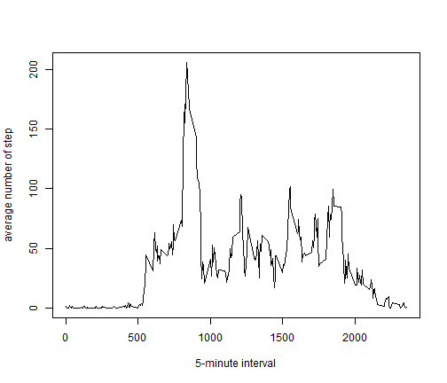

# Reproducible Research: Peer Assessment 1


## Loading and preprocessing the data


```r
LoadData <- read.csv(
    unz("C:\\Users\\Antonio\\Coursera\\Repro_Research\\RepData_PeerAssessment1\\activity.zip", "activity.csv"), header=TRUE, sep=",")

# Process/transform do not necessary in this part
```


## What is mean total number of steps taken per day?


1.-Make a histogram of the total number of steps taken each day


```r
library(ggplot2)
qplot(date, weight = steps, data=LoadData, 
      ylab ="Total number of steps each day", 
      xlab ="Days" )
```

 

2.-Calculate and report the mean and median total number of steps taken per day


```r
mean <- mean(LoadData$steps, na.rm = TRUE)
median <- median(LoadData$steps, na.rm = TRUE)
```

The mean of total number of steps taken per day is 37.3826 and the median is 0


## What is the average daily activity pattern?


1.-Make a time series plot (i.e. type = "l") of the 5-minute interval (x-axis) and the average number of steps taken, averaged across all days (y-axis)


```r
library(plyr)
stepInterval<-ddply(LoadData,.(interval),summarize, 
            mean=mean(steps, na.rm=TRUE))

plot(stepInterval$interval, stepInterval$mean, type="l", 
     ylab="average number of step", xlab="5-minute interval")
```

 


2.-Which 5-minute interval, on average across all the days in the dataset, contains the maximum number of steps?


```r
maxInterval <-stepInterval[grep(max(stepInterval$mean),stepInterval$mean),]
max <-maxInterval$interval
```

The 835 is the 5-minute interval that contains the maximum number of steps

## Imputing missing values

1.-Calculate and report the total number of missing values in the dataset (i.e. the total number of rows with NAs)


```r
N <- colSums(is.na(LoadData))
```

The total number of NA´s of each colum: 

```r
print(N, type="html")
```

   steps     date interval 
    2304        0        0 

2.-Devise a strategy for filling in all of the missing values in the dataset. The strategy does not need to be sophisticated. For example, you could use the mean/median for that day, or the mean for that 5-minute interval, etc.


```r
library(plyr)
# subset data
stepInterval<-ddply(LoadData,.(interval),summarize, 
            mean=mean(steps, na.rm=TRUE))
# filling all missing values with the mean for that 5 minute interval
LoadData[is.na(LoadData)]<- stepInterval$mean
colSums(is.na(LoadData))
```

```
##    steps     date interval 
##        0        0        0
```

3.-Create a new dataset that is equal to the original dataset but with the missing data filled in.

```r
library(plyr)
#new dataset
NewData <- read.csv(
    unz("C:\\Users\\Antonio\\Coursera\\Repro_Research\\RepData_PeerAssessment1\\activity.zip", "activity.csv"), 
    header=TRUE, sep=",")
#subset data
stepInterval<-ddply(NewData,.(interval),summarize, 
            mean=mean(steps, na.rm=TRUE))
# replace missing value with the mean of each interval number
NewData[is.na(NewData)]<- stepInterval$mean
colSums(is.na(NewData))
```

```
##    steps     date interval 
##        0        0        0
```

4.-Make a histogram of the total number of steps taken each day and Calculate and report the mean and median total number of steps taken per day. Do these values differ from the estimates from the first part of the assignment? What is the impact of imputing missing data on the estimates of the total daily number of steps?


```r
library(ggplot2)
qplot(date, weight = steps, data=NewData, 
      ylab ="Total number of steps per day", 
      xlab ="Days" )
```

 

```r
#Calculate and report mean and median

meanNew <- mean(NewData$steps)
medianNew <-median(NewData$steps)

#Do these values differ
LoadData2 <- read.csv(
    unz("C:\\Users\\Antonio\\Coursera\\Repro_Research\\RepData_PeerAssessment1\\activity.zip", "activity.csv"), header=TRUE, sep=",")

p <- (sum(is.na(LoadData2$steps))) / (nrow(LoadData2))
missing <- (p*100 )

totalStepDifer <- (sum(NewData$steps)) - (sum(LoadData2$steps, na.rm=TRUE))
```

The mean of total number of steps taken per day in the new dataset is 37.3826 and the median is 0. The missing data represent 13.1148 %. The differente of total number of steps between the new dataset and original is  8.613 &times; 10<sup>4</sup>.


## Are there differences in activity patterns between weekdays and weekends?


1.- Create a new factor variable in the dataset with two levels - "weekday" and "weekend" indicating whether a given date is a weekday or weekend day.


```r
NewData$day = weekdays(as.Date(NewData$date))
NewData$factor = ifelse(NewData$day == "sábado", "weekend", ifelse(NewData$day =="domingo", "weekend", "weekday"))
```

2.-Make a panel plot containing a time series plot (i.e. type = "l") of the 5-minute interval (x-axis) and the average number of steps taken, averaged across all weekday days or weekend days (y-axis). 


```r
stepIntervalFactor <-ddply(NewData,.(interval, factor),summarize, 
            mean=mean(steps))

library(lattice)
xyplot( mean ~ interval | factor, data = stepIntervalFactor, layout = c(1,2), type ="l",ylab ="Number of steps")
```

 
